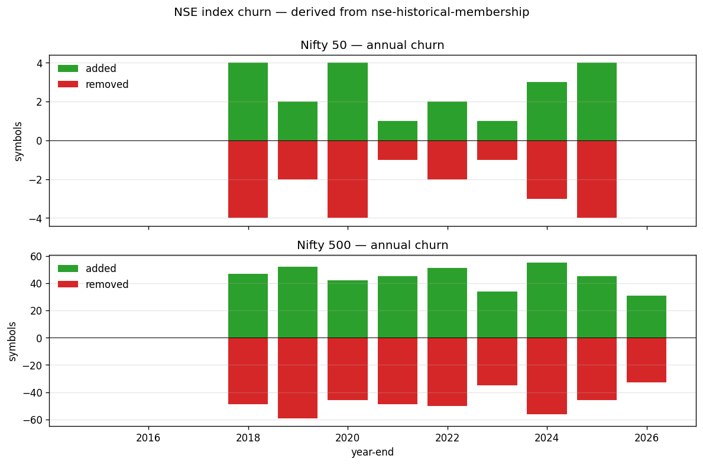

# NSE Historical Membership (Point-in-Time)

[](https://github.com/aditya-jha/nse-historical-membership/actions/workflows/ci.yml)
[](LICENSE-CODE)
[](LICENSE-DATA)

Open-source point-in-time membership tables for NSE (India) — both **index membership** (Nifty 50 / Next 50 / 100 / 500 / Midcap 150 / Smallcap 250) and **F&O segment membership** — derived by parsing public NSE press releases and circulars.



For backtests on Indian equities, you cannot ask "was X in Nifty 500 on 2021-08-15?" today using NSE's own portal — they publish only the current snapshot. This repository fills that gap.

## Data quality at a glance

| Check | Status |
|---|---|
| Famous-transition test (HDFC merger, ZOMATO→ETERNAL, INDIGO/MAXHEALTH inclusion, MINDTREE→LTM, ADANIGAS→ATGL, etc.) | **13/13 PASS** |
| 2024+ archive cross-check (NSE-published constituent count) | ±1 to ±8 symbols |
| 2017+ daily cardinality | Clean |
| Pre-2017 daily cardinality | ±5 to ±7 symbols (incomplete pre-2017 PR coverage) |
| Pytest suite (`pytest tests/`) | **16/16 PASS** |

Run the test suite yourself: `pip install pandas pytest && pytest tests/`.

## Try it in 30 seconds

```bash
git clone https://github.com/aditya-jha/nse-historical-membership && cd nse-historical-membership
pip install pandas
python examples/quickstart.py
```

This answers 5 PIT questions out of the box (HDFC pre/post-merger, Nifty 50 on a specific date, Nifty 500 churn 2020→2024, ZOMATO→ETERNAL inclusion, JIOFIN F&O entry).

## What's in here

```
index_history/
├── data/
│   ├── index_membership_history.csv     # ← headline file (2,820 intervals)
│   ├── current_snapshot/                # NSE Indices' authoritative current CSVs (the seed)
│   ├── parsed/                          # one JSON per parsed press release
│   └── manual_overrides/                # mergers, renames, hand-curated edits
├── code/                                # fetch / parse / build / validate
└── docs/
    ├── EXPERIMENT_LOG.md
    └── validation_report.md             # latest validation run

fno_history/
├── data/
│   ├── fno_membership_history.csv       # ← headline file (311 intervals, 270 symbols)
│   └── parsed/                          # one JSON per parsed circular
├── code/
└── README.md

examples/
├── quickstart.py                        # 5 PIT queries in 30 lines
└── plot_churn.py                        # regenerates docs/churn.png

tests/
└── test_pit_lookups.py                  # 16 asserts (famous transitions + invariants)

CHANGELOG.md · CONTRIBUTING.md · ROADMAP.md
```

## Headline CSVs

### `index_history/data/index_membership_history.csv`

Half-open intervals: `(index_id, index_name, symbol, valid_from, valid_to, source)`. A NULL `valid_to` means the symbol is currently in that index. Query pattern:

```sql
-- Was X in Nifty 500 on 2021-08-15?
SELECT 1 FROM index_membership_history
 WHERE index_name='Nifty 500' AND symbol='MINDTREE'
   AND valid_from <= '2021-08-15'
   AND (valid_to IS NULL OR valid_to > '2021-08-15');
```

Or in pandas:

```python
import pandas as pd
df = pd.read_csv('index_history/data/index_membership_history.csv', parse_dates=['valid_from', 'valid_to'])
def member(index_name, symbol, on):
    on = pd.Timestamp(on)
    m = df[(df.index_name==index_name) & (df.symbol==symbol)
           & (df.valid_from<=on) & (df.valid_to.isna() | (df.valid_to>on))]
    return not m.empty
```

### `fno_history/data/fno_membership_history.csv`

Half-open intervals: `(symbol, valid_from, valid_to, source, source_url, circular_no, notes)`. NULL `valid_to` = currently in F&O segment. A symbol may have multiple intervals (re-introduction after exclusion).

## Data dictionary

| Column | Meaning |
|---|---|
| `index_id` | NSE Indices Ltd internal id (217=Nifty 50, 218=Next 50, 219=100, 221=500, 223=Midcap 150, 227=Smallcap 250) |
| `index_name` | Canonical human-readable name |
| `symbol` | NSE trading symbol, **canonicalised to the terminal name in any rename chain** (e.g., MINDTREE → LTIMindtree → LTM is stored as LTM throughout). See `index_history/data/manual_overrides/symbol_renames.json`. |
| `valid_from`, `valid_to` | Half-open interval `[valid_from, valid_to)`. NULL `valid_to` = currently a member. |
| `weightage` | Free-float weight at the time of the snapshot (only populated for currently-open intervals; NULL for historical) |
| `source` | One of: `circular` (parsed NSE PR), `merger` (manual override for a merger), `snapshot_floor` (interval predates our coverage window — start date is approximate), `inferred-exclude` (interval was open but symbol is not in NSE's current published list, so it was force-closed at the next semi-annual review) |
| `source_url` | NSE publication URL the interval is derived from, where available |
| `notes` | Human-readable provenance (e.g. "closed by ind_prs28022024.pdf") |

Filter on `source` if you want to exclude lower-confidence rows: `source IN ('circular', 'merger')` keeps only PR-backed intervals.

## Coverage and known gaps

**Index history** — high confidence from **2017 onward** for all 6 indices.

- **Famous transitions: 13/13 PASS.** HDFC merger (2023-07), ZOMATO→ETERNAL (2025-03), INDIGO/MAXHEALTH inclusion (2025-09), HEROMOTOCO/INDUSINDBK exclusion (2025-09), MINDTREE→LTIM, ADANIGAS→ATGL. Every transition that has ever been documented in the wild reconciles correctly.
- **2024–2026 archive cross-check**: ±1 to ±8 of NSE's published constituent count on every test date (was ±5 to ±19 before snapshot reconciliation). Remaining drift is one or two missing inclusion events per index that we have not yet captured in PRs.
- **Pre-2017 cardinality**: ±5 to ±7 over the published target. This is the cost of incomplete pre-2017 PR coverage — older NSE press releases were image-only or used inconsistent table layouts that the parser couldn't decode reliably. Backfilling these is the highest-impact contribution path.

The walk-back is **seeded from NSE Indices' authoritative published CSVs** (`archives.nseindia.com/content/indices/ind_nifty*list.csv`). Any walk-back interval still open today whose symbol is NOT in the official current list is automatically closed at the next semi-annual review date with a `notes='inferred-exclude (no PR found)'` marker, so users can filter on the source-confidence level if needed.

**F&O history** — coverage starts **2014**. Symbols added pre-2014 and never excluded since are absent (we don't have an introduction event for them). Of NSE's ~220 currently-tradeable F&O names, this dataset captures 140 in the open intervals; the gap is overwhelmingly long-tenured names like RELIANCE, INFY, TCS that have been in F&O since well before 2014.

See `index_history/docs/validation_report.md` and `fno_history/README.md` for full caveats.

## How it was built

Two independent pipelines because the underlying publishers are different entities:

|                | index_history                                   | fno_history                                        |
|----------------|-------------------------------------------------|----------------------------------------------------|
| Publisher      | NSE Indices Limited                             | NSE Exchange                                       |
| URL            | `niftyindices.com/Press_Release/`               | `nsearchives.nseindia.com/content/circulars/`      |
| Discovery      | `niftyindices.com/press-release?date=YYYY`      | `nseindia.com/api/circulars?dept=FAO`              |
| Anti-bot       | none                                            | session cookies (warm via homepage GET)            |
| File type      | PDF                                             | PDF, sometimes inside `.zip` bundles               |
| Approach       | walk **backward** from current snapshot via PR-driven replacement events, with manual overrides for mergers and rename events | walk **forward** through introduction/exclusion events, half-open intervals |

For image-only PDFs (older NSE press releases were scanned), the parser falls back to `pdftoppm` + `tesseract` OCR.

## Rebuild from source

The raw PDFs are **not** redistributed (NSE owns the underlying publications; we redistribute only the parsed facts). To rebuild from scratch:

```bash
git clone https://github.com/aditya-jha/nse-historical-membership
cd nse-historical-membership
python -m venv venv && source venv/bin/activate
pip install -r requirements.txt

# tesseract for image-only PDFs (optional but recommended)
brew install tesseract poppler              # macOS
# sudo apt install tesseract-ocr poppler-utils    # Linux

# Index history (CSV-only mode, no database needed)
python -m index_history.code.fetch_nse_snapshot          # current authoritative seed from NSE
python -m index_history.code.fetch_press_releases        # cache PRs locally (~1100 PDFs)
python -m index_history.code.parse_all                   # PDF -> parsed/*.json
python -m index_history.code.build_history --csv-out index_history/data/index_membership_history.csv

# F&O history
python -m fno_history.code.fetch_circulars
python -m fno_history.code.parse_circulars
python -m fno_history.code.build_history                 # see fno_history/README for CSV mode
```

If you have a Postgres backend you can also run `build_history` without `--csv-out` and `validate` to check against an `index_equity_map_archive` table; the CSV-out mode is the path with no infrastructure dependencies. The `parsed/*.json` files are the portable intermediate output.

## Legal

The factual contents — dates, symbols, index/F&O membership — are derived from publicly-published NSE press releases and SEBI-mandated circulars. Facts are not copyrightable in India (cf. *Eastern Book Co. v. D.B. Modak*, 2008 SCC). What is original to this repository — the parsing, normalization, and PIT reconciliation — is offered under the licenses below.

The **raw NSE press release / circular PDFs** themselves remain the property of their respective publishers and are intentionally **not** redistributed in this repository. Use the fetch scripts to obtain them directly from NSE.

Index names ("Nifty 50" etc.) are trademarks of NSE Indices Limited. This project is independent of, not affiliated with, and not endorsed by NSE Indices Limited or NSE Exchange.

**Code:** [MIT](LICENSE-CODE) — `LICENSE-CODE`
**Data:** [CC BY 4.0](LICENSE-DATA) — `LICENSE-DATA`

## Disclaimer

This data is provided "as-is" with documented coverage gaps. **Independently verify any output before relying on it for trading, research, or compliance.** The authors assume no liability for trading losses, regulatory issues, or any other consequences arising from use of this data.

## Contributing

See [`CONTRIBUTING.md`](CONTRIBUTING.md) for the five contribution paths and PR conventions, and [`ROADMAP.md`](ROADMAP.md) for an explicit list of open tasks (R1–R12) ranked by leverage. Highest-impact contributions: backfilling pre-2017 NSE Indices PRs (R1), pre-2014 F&O introductions (R2), and adding sector indices like Nifty Bank / Nifty IT (R3).

To request a new task or report a data-quality issue, open a GitHub Issue. Issues that block production use of the dataset jump the queue.

## Citation

If this dataset informs published research or a derivative work:

```bibtex
@misc{nse_historical_membership_2026,
  author       = {Jha, Aditya},
  title        = {{NSE} Historical Membership (Point-in-Time)},
  year         = {2026},
  howpublished = {\url{https://github.com/aditya-jha/nse-historical-membership}},
  note         = {Derived from public NSE Indices Limited press releases
                  and NSE Exchange circulars. CC BY 4.0.}
}
```

Plain-text form:

> Jha, A. (2026). *NSE Historical Membership (Point-in-Time)*. GitHub. https://github.com/aditya-jha/nse-historical-membership

The CC BY 4.0 license requires attribution. A link to this repository plus the citation above satisfies the license; a [Zenodo DOI](ROADMAP.md#r11--zenodo-doi-registration) will be added at v0.1.0 tag for academic-style citations.

## Used by

If your work depends on this dataset, open an Issue with `[Used by]` in the title — we'll add a line here. Empty until the first user adds themselves.
